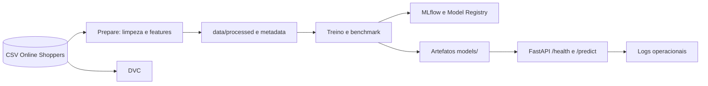

# Tech Challenge Fase 2: Predicao de Conversao

<p align="center">
  
  
  
  
  
</p>

Pipeline de Machine Learning para estimar se uma sessao de navegacao de um e-commerce resultara
em compra (`Revenue`). A solucao combina engenharia de features, Random Forest, benchmark de
modelos, threshold calibrado, MLflow, DVC, FastAPI, monitoramento e testes automatizados.

## Objetivo de negocio

A predicao apoia marketing e UX na priorizacao de sessoes com maior propensao a conversao. O
resultado pode orientar chat proativo, oferta personalizada, cupom dinamico ou campanhas para
visitantes novos e recorrentes. A politica de intervencao deve considerar custo, grupo de controle
e o resultado posterior da sessao; a acuracia isolada nao e criterio suficiente.

## Dados e escopo

O projeto usa o dataset [Online Shoppers Purchasing Intention](https://archive.ics.uci.edu/dataset/468/online+shoppers+purchasing+intention),
com 12.330 sessoes coletadas ao longo de um ano. A variavel alvo `Revenue` indica se a sessao
gerou compra. A classe positiva representa 15,63% das sessoes, portanto F1, PR-AUC, precision e
recall sao mais informativos que a acuracia isolada.

As entradas combinam comportamento de navegacao, tempo em paginas, metricas de Analytics, mes,
fim de semana, tipo de visitante, navegador, sistema operacional, regiao e origem de trafego.
O pipeline cria features derivadas de volume e tempo de sessao, aplica encoding persistido e usa
SMOTE no treino para lidar com o desbalanceamento.

## Resultado do modelo

O Random Forest apresentou no conjunto de avaliacao:

| Metrica | Resultado |
| --- | ---: |
| Acuracia | 0,8972 |
| Precision | 0,6650 |
| Recall | 0,6911 |
| F1-Score | 0,6778 |
| PR-AUC | 0,7065 |
| ROC-AUC | 0,9266 |

Na validacao cruzada, as medias foram F1 `0,6844`, PR-AUC `0,6950` e ROC-AUC `0,9222`. O
threshold otimizado para F1 foi `0,510996`, elevando o F1 para `0,6806` e a precision para
`0,6779`. Esse ganho e pequeno: em producao, o limiar deve ser revisado conforme o custo de
falsos positivos, falsos negativos e incentivos concedidos.

## Arquitetura do pipeline



O código principal fica em `src/ml_project`:

- `dataset.py`, `features.py` e `preprocessing.py`: preparação da base e engenharia de features;
- `pipeline.py`: orquestração e persistência do processamento;
- `modeling/train.py`: benchmark, validação cruzada, threshold, métricas e artefato;
- `modeling/predict.py`: carregamento do modelo, metadata e predição;
- `model_registry.py`: promoção, aprovação e rollback;
- `monitoring.py`: métricas operacionais e detecção de drift;
- `src/api/api.py`: contrato HTTP, validação, erros estruturados e logs por requisição.

## Requisitos e instalação

- Python 3.11, 3.12 ou 3.13
- `uv`
- `just`
- Docker, opcional para execução em container

```bash
just install
```

O dataset de entrada deve estar em `data/raw/online_shoppers_intention.csv`. Para habilitar o
benchmark opcional com XGBoost:

```bash
uv sync --extra benchmark
```

## Execucao

Preparar dados e treinar:

```bash
just dvc-repro
```

Ou executar cada etapa diretamente:

```bash
uv run python -m src.ml_project.pipeline prepare
uv run python -m src.ml_project.modeling.train
```

O preparo gera o dataset intermediario, o `.npz` processado, o preprocessor e metadata com
fingerprint, distribuicao do alvo, schema e colunas usadas. O treino salva o modelo em
`models/model.joblib`, alem de metadata, nomes de features, preprocessor, relatorios e informacoes
de versao.

Comandos de qualidade e documentacao:

```bash
just lint
just test
just serve-docs
just serve-mlflow
```

O MLflow local fica em `http://127.0.0.1:5000` e usa `./mlruns` como backend filesystem.

## API de inferencia

Inicie o servico depois de preparar os artefatos:

```bash
just api
```

A API fica em `http://localhost:8000`, com Swagger em `/docs` e os endpoints:

| Metodo | Endpoint | Funcao |
| --- | --- | --- |
| `GET` | `/health` | Verifica modelo, metadata e preprocessor |
| `POST` | `/predict` | Prediz uma ou mais sessoes |

O contrato `1.0` exige exatamente 17 campos brutos por instancia. `Revenue` e as features
derivadas sao internas e nao devem ser enviados. O lote deve ter ao menos uma instancia, campos
extras sao rejeitados e os erros usam codigos como `INVALID_INPUT_SCHEMA`, `MODEL_NOT_FOUND`,
`MODEL_SCHEMA_MISMATCH` e `PREDICTION_FAILED`. Consulte o [contrato completo](docs/inference-contract.md).

Exemplo:

```bash
curl -X POST http://localhost:8000/predict \
  -H "Content-Type: application/json" \
  -d '{
    "contract_version": "1.0",
    "instances": [{
      "Administrative": 0,
      "Administrative_Duration": 0.0,
      "Informational": 0,
      "Informational_Duration": 0.0,
      "ProductRelated": 1,
      "ProductRelated_Duration": 0.0,
      "BounceRates": 0.2,
      "ExitRates": 0.2,
      "PageValues": 0.0,
      "SpecialDay": 0.0,
      "Month": "Feb",
      "OperatingSystems": 1,
      "Browser": 1,
      "Region": 1,
      "TrafficType": 1,
      "VisitorType": "Returning_Visitor",
      "Weekend": false
    }]
  }'
```

A resposta preserva a ordem das instancias e informa `contract_version`, `model_version`,
`prediction_id` e `predicted_revenue` (`0` ou `1`).

## Governanca e monitoramento

Quando `MLFLOW_ENABLE_MODEL_REGISTRY=true`, cada treino registra `runs:/<run_id>/model` no
Model Registry. Novas versoes entram em `Staging` com aprovacao pendente; a promocao para
`Production` exige aprovador e justificativa:

```bash
uv run python -m src.ml_project.model_registry promote \
  --version 1 --target-status Production \
  --approver "nome.aprovador" --reason "Metricas aprovadas para producao"
```

Para rollback:

```bash
uv run python -m src.ml_project.model_registry rollback \
  --version 1 --approver "nome.aprovador" \
  --reason "Regressao detectada na versao atual"
```

A trilha fica em `models/model_registry.json` e `models/model_registry_events.json`. Para usar a
versao governada na inferencia, habilite `MLFLOW_USE_MODEL_REGISTRY_FOR_INFERENCE=true`.

Para comparar dois CSVs e detectar drift:

```bash
just drift reference=data/reference.csv current=data/current.csv
```

O relatorio vai para `models/reports/drift_report.json` e os eventos para
`logs/operational_metrics.jsonl`. Em producao, acompanhe por versao e segmento PR-AUC, precision,
recall, F1, taxa de conversao e custo por intervencao.

## Docker

As imagens usam build multi-stage. Para construir e executar o smoke test:

```bash
just docker-build
just docker-smoke
```

O Docker Compose expoe a API em `http://localhost:8000`. O smoke test desabilita o Model Registry
porque o backend filesystem do MLflow pode nao criar versoes em volumes bind-mounted com usuario
nao-root. Para governanca em container, use um backend MLflow/DB compartilhado.

## Estrutura do repositorio

```text
.
├── data/                 # dados raw, interim e processados
├── docs/                 # documentacao e contrato de inferencia
├── models/               # artefatos, relatorios e registry local
├── src/ml_project/       # pipeline, treino, predicao e monitoramento
├── src/api/              # aplicacao FastAPI
├── tests/                # testes automatizados
├── dvc.yaml              # etapas prepare e train
├── justfile              # automacao de desenvolvimento
└── pyproject.toml        # dependencias e configuracao
```

Para o racional de negocio, metricas, riscos e criterio de sucesso, consulte o [ML Canvas](docs/mlcanvas.md).

## Licenca

MIT
